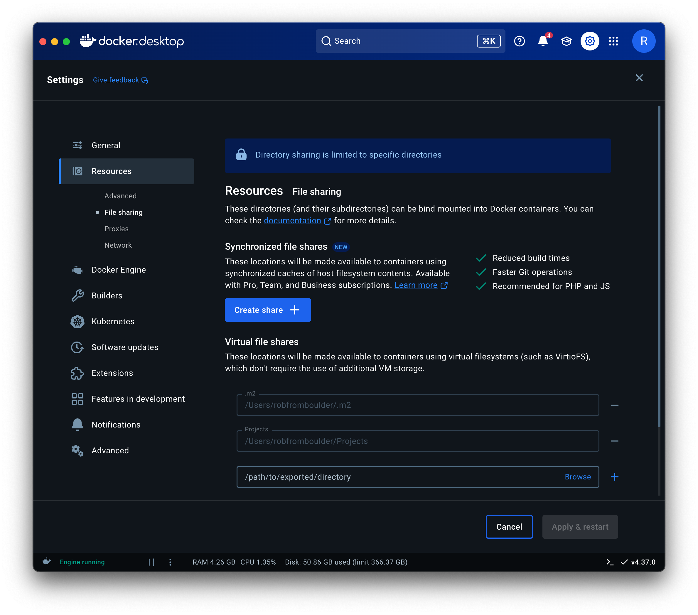

# Contributing to graylog-plugin-aisearch

Official (and somewhat generic) documentation on writing plugins is available at https://docs.graylog.org/docs/plugins. This guide
offers copy-and-paste commands that are specific to this plugin, to hopefully save you time. 😀

⚠️ Don't clone this repo before following this guide. The build relies on relative paths, so it's critical that your
directory structure is correct. Follow the steps below and you'll be up and running in 15 minutes or less.

🛟 If this guide doesn't work for you, please [log an issue](https://github.com/graylog-labs/graylog-plugin-aisearch/issues).

## Configuring Development Environment

1. Create a `graylog2` directory where you'll keep Graylog development projects:
```bash
mkdir ~/Projects/graylog2
cd ~/Projects/graylog2
```
👆 This is the working directory where you'll run all the shell commands in this guide. Multiple subdirectories will be created here for you.

2.️ When using Docker Desktop on Mac, configure `~/Projects` and `~/.m2` shared directories as shown here:
<p></p>

3. Add [tugboat](https://github.com/robfromboulder/tugboat) alias to your bash/zsh shell:
```bash
alias tugboat='docker run -v $(pwd):/root/work -v ~/.m2:/root/.m2 --rm -it robfromboulder/tugboat:6.1.0a'
```
👆 Add this to `~/.bashrc` or `~/.zshrc` if you use tugboat frequently.

4. Bootstrap Graylog development projects:
```bash
tugboat graylog-project bootstrap https://github.com/Graylog2/graylog-project.git --manifest manifests/6.1.json
```

5. Compile Graylog server: (this takes a few minutes so be patient)
```bash
tugboat mvn -f graylog-project/pom.xml compile
```

6. Clone the plugin repo from GitHub:
```bash
git clone git@github.com:graylog-labs/graylog-plugin-aisearch.git graylog-project-repos/graylog-plugin-aisearch
```

## Building and Testing Plugin

1. Build plugin using Maven:
```bash
tugboat mvn -f graylog-project-repos/graylog-plugin-aisearch/pom.xml -Dmaven.javadoc.skip=true -DskipTests compile package
```

2. Run [supertanker](https://github.com/robfromboulder/supertanker) using latest plugin jar:
```bash
docker run -d --name supertanker -v ./graylog-project-repos/graylog-plugin-aisearch/target:/home/plugin -v supertanker:/data -e GRAYLOG_DATANODE_INSECURE_STARTUP="true" -e GRAYLOG_DATANODE_PASSWORD_SECRET="somepasswordpeppersomepasswordpeppersomepasswordpeppersomepasswordpepper" -e GRAYLOG_HTTP_EXTERNAL_URI="http://localhost:9000/" -e GRAYLOG_PASSWORD_SECRET="somepasswordpeppersomepasswordpeppersomepasswordpeppersomepasswordpepper" -e GRAYLOG_ROOT_PASSWORD_SHA2="8c6976e5b5410415bde908bd4dee15dfb167a9c873fc4bb8a81f6f2ab448a918" -e TZ=UTC -p 5044:5044/tcp -p 5140:5140/tcp -p 5140:5140/udp -p 9000:9000/tcp -p 12201:12201/tcp -p 12201:12201/udp -p 13301:13301/tcp -p 13302:13302/tcp robfromboulder/supertanker:6.1.4c
```

3. Show plugin messages in logs:
```bash
docker exec -it supertanker bash -c "cat graylog-stdout* | grep -i aisearch"
```

4. Stop supertanker and remove all data:
```bash
docker stop supertanker; docker rm supertanker; docker volume rm supertanker
```

## Generating Plugin Skeleton

1. Generate plugin scaffolding with default params:
```bash
cd graylog-project-repos/graylog-plugin-aisearch && rm -rf .mvn/jvm.config build.config.js package.json pom.xml src webpack.config.js && cd .. && tugboat mvn archetype:generate -DarchetypeGroupId=org.graylog -DarchetypeArtifactId=graylog-plugin-archetype -DpluginClassName=AISearch -DgithubRepo=graylog-labs/graylog-plugin-aisearch -DownerName=Graylog -DownerEmail=support@graylog.com -DgroupId=org.graylog -DartifactId=graylog-plugin-aisearch -Dpackage=org.graylog.aisearch -Dversion=6.1.0-SNAPSHOT && cd ..
```
2. Run `nano graylog-project-repos/graylog-plugin-aisearch/pom.xml` and update web-parent version to `6.1.4`
3. At this point the build will fail unless `com.google.inject` dependency is added manually in pom.xml [#1](https://github.com/graylog-labs/graylog-plugin-aisearch/issues/1) 🤔
4. Diff generated files against prior version (if present) and re-apply changes as necessary

## Using IDEA

IDEA isn't required to contribute to this project -- but if you use IDEA, you'll enjoy all the benefits 🔥

1. Open the meta project in `~/Projects/graylog2/graylog-project/pom.xml`
2. Add `graylog-plugin-aisearch` to pom.xml
3. Seeing lots of files reported as changed [#2](https://github.com/graylog-labs/graylog-plugin-aisearch/issues/2) 🤔